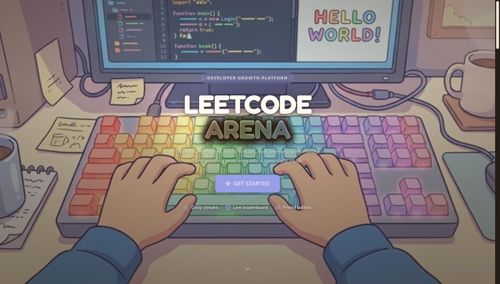
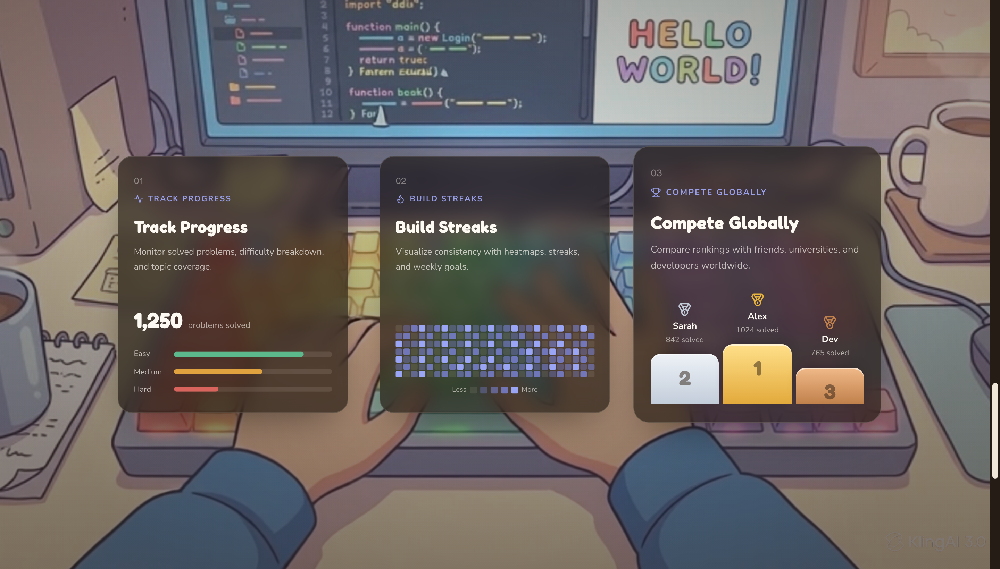
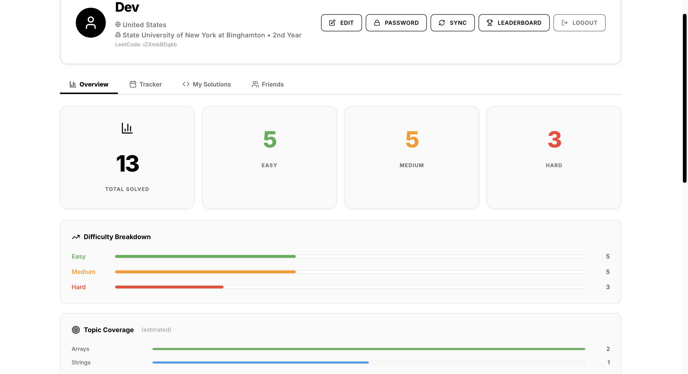
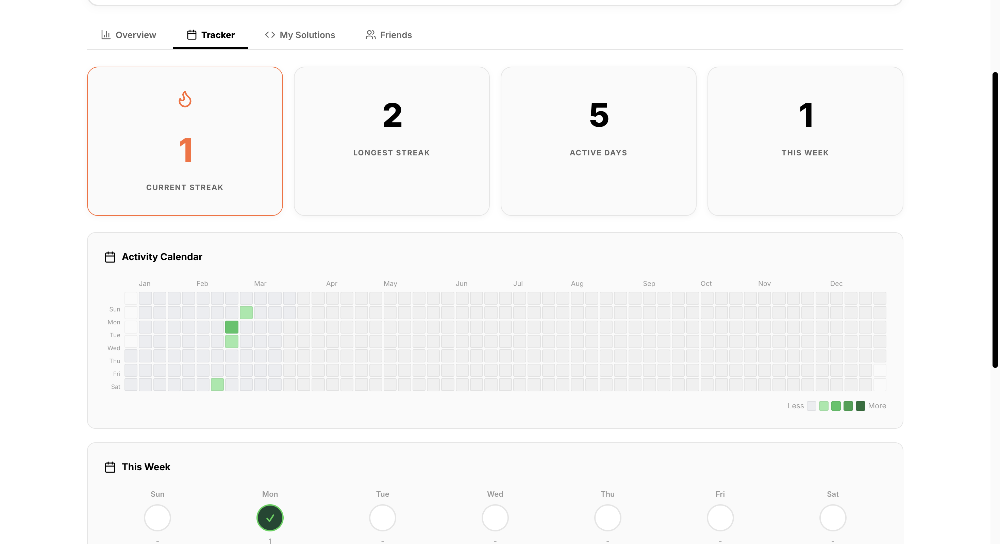
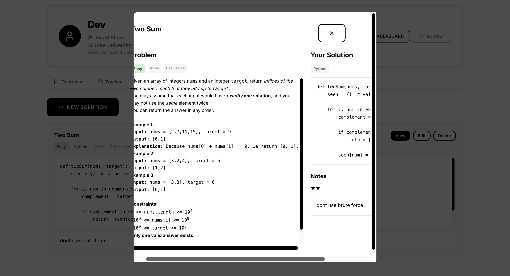
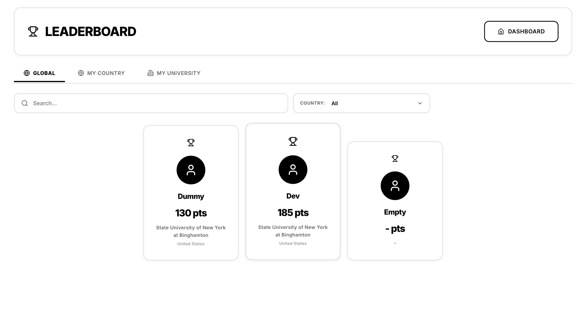
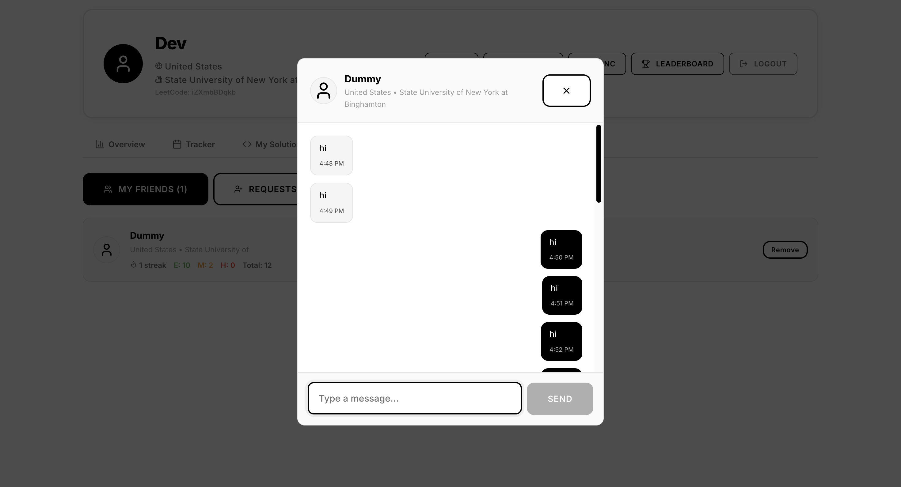

# Code Manager

A developer growth platform that connects to your LeetCode account to track progress, visualize activity, and compete with peers at your university or country.

## Screenshots

### Landing Page
A cozy, video-driven hero with a scroll-accumulation feature section and interactive cursor effects.





### Dashboard Overview
Track your total problems solved, difficulty breakdown, and estimated topic coverage.



### Activity Tracker
Visualize your coding consistency with a heatmap calendar, streak tracking, and weekly goals.



### My Solutions
Save code snippets and notes for problems. View the problem description side-by-side with your solution.



### Leaderboard
Compete globally or filter by country and university. Top 3 shown on a podium.



### Friends & Chat
Add friends, view their stats, and message them in real-time.



## Features

- **LeetCode Integration** - Syncs your solved problems, difficulty breakdown, and rankings directly from LeetCode
- **Activity Tracker** - Heatmap calendar, streak tracking, and weekly goal setting
- **My Solutions** - Save code snippets and notes for problems with LeetCode problem fetching
- **Leaderboard** - Global, country, and university-level rankings
- **Friends & Chat** - Add friends, view their profiles/stats, and message them in real-time
- **Profile Management** - Edit education info, change password, customize weekly goals

## Tech Stack

- **Frontend:** React, Axios, Lucide Icons, Socket.io Client
- **Backend:** Express, MongoDB/Mongoose, JWT Auth, Socket.io
- **Security:** Helmet, Rate Limiting, Input Validation (express-validator)

## Getting Started

### Prerequisites

- Node.js (v16+)
- MongoDB (local or Atlas)

### Setup

1. Clone the repo
   ```bash
   git clone https://github.com/DevNagi31/leetcode-arena.git
   cd leetcode-arena
   ```

2. Install dependencies
   ```bash
   npm install
   cd server && npm install && cd ..
   ```

3. Create environment files

   **`server/.env`**
   ```
   MONGODB_URI=your_mongodb_connection_string
   JWT_SECRET=your_jwt_secret
   ```

   **`.env.production`** (for production builds)
   ```
   REACT_APP_API_URL=your_production_api_url
   ```

4. Run in development
   ```bash
   npm run dev
   ```
   This starts both the React frontend (port 3000) and Express backend (port 5001) concurrently.

### Scripts

| Command | Description |
|---------|-------------|
| `npm start` | Start React dev server |
| `npm run server` | Start backend server |
| `npm run dev` | Start both frontend and backend |
| `npm run build` | Build for production |

## Project Structure

```
├── public/                 # Static assets
├── server/
│   ├── data/               # Static data (countries.json)
│   ├── middleware/          # Auth, security, validation
│   ├── models/             # Mongoose schemas
│   ├── routes/             # API route handlers
│   ├── services/           # LeetCode & university APIs
│   └── server.js           # Express + Socket.io entry point
├── src/
│   ├── components/         # React components
│   ├── styles/             # CSS
│   └── App.js              # Main app with all views
└── package.json
```

## API Routes

| Route | Description |
|-------|-------------|
| `POST /api/auth/verify-leetcode` | Verify LeetCode username |
| `POST /api/auth/register` | Register new user |
| `POST /api/auth/login` | Login |
| `GET /api/users/me` | Get current user |
| `POST /api/users/refresh-stats` | Sync LeetCode stats |
| `GET /api/leaderboard` | Get leaderboard (filterable) |
| `GET /api/friends` | Friends list |
| `GET/POST /api/snippets` | Code snippets CRUD |
| `GET/POST /api/notes` | Notes CRUD |
| `GET/POST /api/messages` | Chat messages |
| `POST /api/leetcode/problem` | Fetch problem details |

## License

ISC
