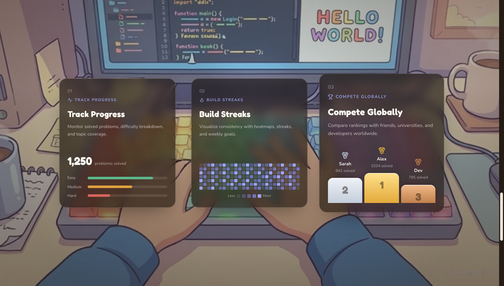
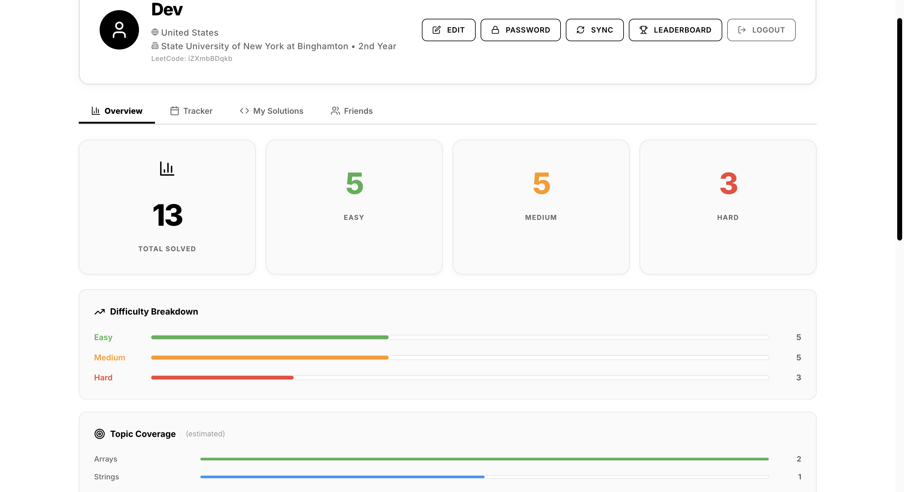
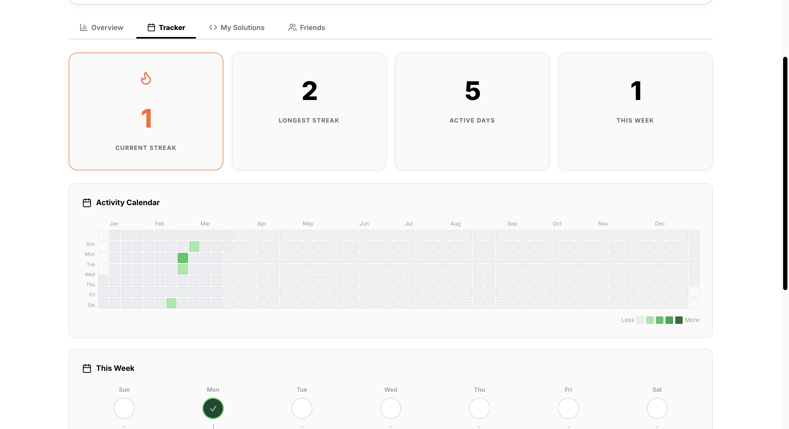
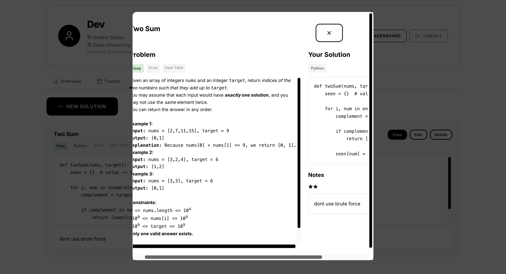
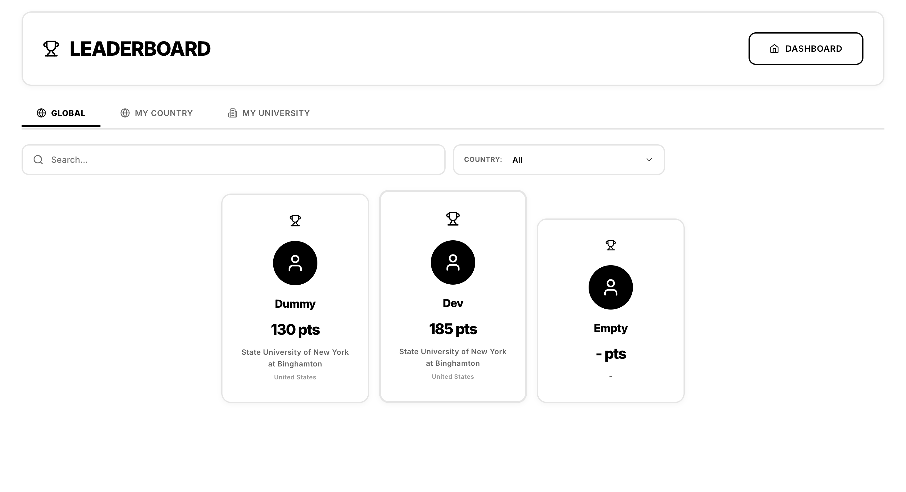
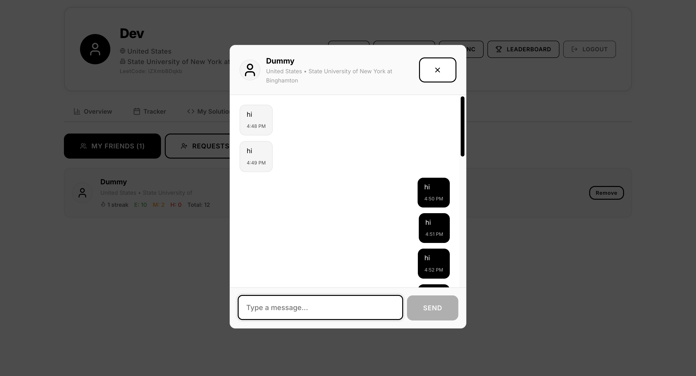

# Code Manager

A developer growth platform that connects to your LeetCode account to track progress, visualize activity, and compete with peers at your university or country.

## Screenshots

### Landing Page
A cozy, video-driven hero with a scroll-accumulation feature section and interactive cursor effects.




### Dashboard Overview
Track your total problems solved, difficulty breakdown, and estimated topic coverage.



### Activity Tracker
Visualize your coding consistency with a heatmap calendar, streak tracking, and weekly goals.



### My Solutions
Save code snippets and notes for problems. View the problem description side-by-side with your solution.



### Leaderboard
Compete globally or filter by country and university. Top 3 shown on a podium.



### Friends & Chat
Add friends, view their stats, and message them in real-time.



## Features

- **LeetCode Integration** - Syncs your solved problems, difficulty breakdown, and rankings directly from LeetCode
- **Activity Tracker** - Heatmap calendar, streak tracking, and weekly goal setting
- **My Solutions** - Save code snippets and notes for problems with LeetCode problem fetching
- **Leaderboard** - Global, country, and university-level rankings
- **Friends & Chat** - Add friends, view their profiles/stats, and message them in real-time
- **Profile Management** - Edit education info, change password, customize weekly goals

## Tech Stack

- **Frontend:** React 18, Vite, Axios, Lucide Icons, Socket.io Client
- **Backend:** Express, MongoDB/Mongoose, JWT Auth, Socket.io
- **Security:** Helmet, Rate Limiting, Input Validation (express-validator)

## Getting Started

### Prerequisites

- Node.js (v16+)
- MongoDB (local or Atlas)

### Setup

1. Clone the repo
   ```bash
   git clone https://github.com/DevNagi31/leetcode-arena.git
   cd leetcode-arena
   ```

2. Install dependencies
   ```bash
   npm install
   cd server && npm install && cd ..
   ```

3. Create environment files

   **`server/.env`**
   ```
   MONGODB_URI=your_mongodb_connection_string
   JWT_SECRET=your_jwt_secret
   ```

   **`.env.production`** (for production builds)
   ```
   REACT_APP_API_URL=your_production_api_url
   ```

4. Run in development
   ```bash
   npm run dev
   ```
   This starts the Vite dev server (port 3000) and the Express backend (port
   5001) concurrently. Vite proxies `/api` and the Socket.io websocket to the
   backend, so the browser only ever talks to port 3000.

   If the backend runs on a different port, point the proxy at it:
   ```bash
   VITE_PROXY_TARGET=http://localhost:5055 npm start
   ```

### Scripts

| Command | Description |
|---------|-------------|
| `npm start` | Start the Vite dev server |
| `npm run server` | Start the backend server |
| `npm run dev` | Start both frontend and backend |
| `npm run build` | Build for production into `build/` |
| `npm run preview` | Serve the production build locally |
| `npm test` | Frontend tests (Vitest) |

## Project Structure

```
├── index.html              # Vite entry point
├── vite.config.js          # Build, dev proxy and test config
├── public/                 # Static assets served from the site root
├── server/
│   ├── data/               # Static data (countries.json)
│   ├── middleware/          # Auth, security, validation
│   ├── models/             # Mongoose schemas
│   ├── routes/             # API route handlers
│   ├── scripts/            # One-off maintenance scripts
│   ├── services/           # LeetCode & university APIs
│   ├── utils/              # Tier and activity helpers
│   └── server.js           # Express + Socket.io entry point
├── src/
│   ├── components/         # React components (.jsx)
│   ├── styles/             # CSS
│   ├── utils/              # API client, constants, hooks
│   └── App.jsx             # Main app with all views
└── package.json
```

## API Routes

| Route | Auth | Description |
|-------|------|-------------|
| `GET /api/health` | – | Liveness + DB status |
| `POST /api/auth/register` | – | Register (LeetCode stats are verified server-side) |
| `POST /api/auth/login` | – | Login |
| `POST /api/auth/logout` | ✓ | Blacklist the current token |
| `POST /api/auth/forgot-password` | – | Email a 6-digit reset code |
| `POST /api/auth/verify-reset-code` | – | Exchange the code for a reset token |
| `POST /api/auth/reset-password` | – | Set a new password |
| `POST /api/auth/verify-email` | ✓ | Confirm the signup code |
| `POST /api/auth/resend-verification` | ✓ | Re-send the signup code |
| `GET /api/users/me` | ✓ | Current user, ranks and tier |
| `POST /api/users/refresh-stats` | ✓ | Re-sync from LeetCode |
| `PUT /api/users/profile` | ✓ | Update institution / level / year |
| `PUT /api/users/change-password` | ✓ | Change password |
| `PUT /api/users/weekly-goal` | ✓ | Set the weekly target |
| `GET /api/leaderboard` | – | Leaderboard (`country`, `institution`, `page`) |
| `GET /api/leaderboard/countries` | – | Countries that have users |
| `GET /api/leaderboard/institutions` | – | Institutions, optionally by country |
| `GET /api/universities/search` | – | University autocomplete |
| `GET /api/friends` | ✓ | Friends list |
| `GET /api/friends/requests` | ✓ | Pending requests |
| `POST /api/friends/send` | ✓ | Send a request by username |
| `POST /api/friends/accept/:id` | ✓ | Accept a request |
| `DELETE /api/friends/:id` | ✓ | Remove a friend |
| `GET/POST/PUT/DELETE /api/snippets` | ✓ | Code snippets CRUD |
| `GET/POST/PUT/DELETE /api/notes` | ✓ | Notes CRUD |
| `GET /api/messages/:friendId` | ✓ | Message history |
| `GET /api/messages/unread/count` | ✓ | Unread counts, keyed by sender id |
| `POST /api/leetcode/problem` | ✓ | Fetch a problem by slug or number |
| `GET /api/leetcode/solved` | ✓ | Recent accepted submissions |

Real-time chat runs over Socket.io on the same origin, authenticated with the
same JWT (`auth: { token }` on the connection).

---

## Deploying

The app ships as a **single service**: Express serves the API *and* the compiled
React build, so there is one URL, one origin, and no CORS to configure. The
repo's `render.yaml` describes exactly that.

### 1. Provision a database

Create a free MongoDB Atlas cluster (Atlas → *Build a Database* → M0):

1. **Database Access** → add a user with a password. Save the password.
2. **Network Access** → add `0.0.0.0/0`. Render's outbound IPs are not static
   on the free plan, so an allowlist of specific addresses will not work.
3. **Connect** → *Drivers* → copy the `mongodb+srv://...` string and put your
   real password in it. Append a database name, e.g. `/leetcode-arena`.

### 2. Set up email delivery

Verification and password-reset codes are emailed, and the dashboard is gated
on verification — so if mail doesn't arrive, **nobody can finish signing up**.
Without SMTP the server still runs, but codes are only written to its log.

**Send through Gmail's own servers.** All six variables are required:

```
SMTP_HOST=smtp.gmail.com
SMTP_PORT=587
SMTP_SECURE=false
SMTP_USER=you@gmail.com
SMTP_PASS=your-16-char-app-password        # myaccount.google.com/apppasswords
EMAIL_FROM=you@gmail.com                   # must match SMTP_USER
```

`EMAIL_FROM` is **not optional**. Without it the server falls back to
`no-reply@leetcode-arena.local`, which is not a real domain and which no
provider will accept — mail is then rejected at the SMTP layer while the
connection and the credentials both look perfectly healthy.

The App Password needs 2-Step Verification enabled on the Google account first.
Afterwards check `/api/health`: it reports whether email is configured and
names any variable still missing.

#### Why the provider has to match the From address

This is the part that silently ruins deliverability, so it's worth stating
plainly. `gmail.com` publishes an SPF record authorising only Google's servers:

```
gmail.com          v=spf1 redirect=_spf.google.com
_spf.google.com    ip4:74.125.0.0/16 ip4:209.85.128.0/17 ...
_dmarc.gmail.com   v=DMARC1; p=none; sp=quarantine
```

Send as `you@gmail.com` through a third party such as Brevo or SendGrid and the
mail leaves from an IP `gmail.com` does not authorise, signed by a domain that
isn't `gmail.com`. **SPF fails, DKIM doesn't align, so DMARC fails.** The policy
is `p=none` so it isn't hard-rejected, but receivers fall back to their own
heuristics — and unauthenticated mail claiming to come from `gmail.com` is
exactly what those are built to catch. It lands in spam, or is dropped.

Sending through `smtp.gmail.com` means the mail genuinely originates from an
authorised Google IP and is DKIM-signed as `gmail.com`, so both align and it
reaches the inbox. Same From address, completely different outcome.

#### Growing past it

Gmail allows roughly **500 recipients a day**, and it is your personal mailbox's
reputation at stake. Google tolerates this at low volume but will throttle it,
so once there is real traffic, move to a domain you control:

1. Register one — students can get a year free through the
   [GitHub Student Developer Pack](https://education.github.com/pack)
   (Namecheap `.me`, or name.com).
2. Add it to a transactional provider (Brevo, Resend, SendGrid, Postmark) and
   publish the SPF and DKIM records they give you, plus a DMARC record.
3. Set `EMAIL_FROM=noreply@yourdomain.com` and point `SMTP_*` at that provider.

The From domain and the sending infrastructure now agree, alignment passes, and
you are no longer capped by a personal mailbox.

Avoid free TLDs such as `.tk` or `.ml` here. Freenom stopped issuing them in
2023, and their spam reputation means mail from them is filtered on sight —
worse than sending nothing at all.

### 3. Deploy to Render

1. Push this repo to GitHub.
2. Render → **New** → **Blueprint** → pick the repo. It reads `render.yaml`
   and creates the service with the right build and start commands.
3. Fill in the environment variables it marks as required:

   | Variable | Value |
   |----------|-------|
   | `MONGODB_URI` | The Atlas connection string from step 1 |
   | `JWT_SECRET` | A long random string — generate with `openssl rand -base64 48` |
   | `CORS_ORIGIN` | Your Render URL, e.g. `https://code-manager.onrender.com` |
   | `SMTP_*`, `EMAIL_FROM` | From step 2 |

   `NODE_ENV=production` and `PORT` are set for you.

4. Deploy. First build takes a few minutes. Check `https://<your-app>/api/health`
   — it should return `{"status":"ok","db":"connected"}`.

5. **If you are upgrading an existing deployment**, run the activity migration
   once against the production database (see below). Fresh deployments can skip
   this.

`CORS_ORIGIN` is a comma-separated list; add every origin you serve from. Since
the frontend is same-origin it mostly matters for the Socket.io handshake.

**Free-plan caveat:** Render spins the service down after 15 minutes of
inactivity, so the first request afterwards takes ~30–60s. Upgrade to a paid
instance to avoid it.

### Deploying elsewhere

Nothing is Render-specific — any host that runs Node 18+ works:

```bash
npm install && cd server && npm install && cd ..
npm run build
NODE_ENV=production node server/server.js
```

Set the same environment variables. The server trusts one proxy hop
(`trust proxy`) and redirects to HTTPS only when `x-forwarded-proto` says the
request arrived over plain HTTP, so it works behind a TLS-terminating proxy and
also runs directly for local testing.

**Fly.io / Railway / a VPS:** identical — build, set the env vars, run the start
command, and point a TLS-terminating proxy at `$PORT`.

**Splitting the frontend onto a CDN** (Vercel/Netlify) is supported but not the
default. Set `VITE_API_URL` to the API's origin before building, and add
the static host's origin to `CORS_ORIGIN` on the API.

### Migrating an existing database

Daily activity used to live in an `activityDates` array embedded in each user
document. It now has its own `activities` collection, so an existing database
needs a one-time migration:

```bash
cd server
MONGODB_URI="<your production URI>" node scripts/migrate-activity.js --dry-run  # report only
MONGODB_URI="<your production URI>" node scripts/migrate-activity.js            # migrate
```

The script copies each embedded day into the new collection, merges any
duplicate dates, creates the unique `(userId, date)` index, and only then drops
the old array. It is safe to re-run — a second run reports zero users — so an
interrupted migration can simply be run again.

Deploy the new code *before* running it: the old code reads the embedded array
and will not see the migrated rows.

### Environment variables

| Variable | Required | Notes |
|----------|----------|-------|
| `MONGODB_URI` | yes | Mongo connection string |
| `JWT_SECRET` | yes | Server refuses to start without it |
| `CORS_ORIGIN` | prod | Comma-separated origins; defaults to `http://localhost:3000` |
| `PORT` | no | Defaults to `5001`; hosts usually inject this |
| `NODE_ENV` | prod | `production` enables the SPA, CSP and HTTPS redirect |
| `SMTP_HOST` / `SMTP_PORT` / `SMTP_SECURE` / `SMTP_USER` / `SMTP_PASS` | prod | Without these, codes only reach the server log |
| `EMAIL_FROM` | prod | From address. **Required** — with Gmail it must match `SMTP_USER` |
| `CLOUDINARY_CLOUD_NAME` / `CLOUDINARY_API_KEY` / `CLOUDINARY_API_SECRET` | no | Set all three to store note photographs on Cloudinary instead of inline in MongoDB. See below |
| `CLOUDINARY_FOLDER` | no | Upload folder; defaults to `leetcode-arena/notes` |
| `VITE_API_URL` | no | Only when the API is on a different origin; baked in at build time |
| `VITE_PROXY_TARGET` | no | Dev only — where `npm start` proxies `/api`; defaults to `http://localhost:5001` |

### Note photographs and storage

Notes can carry photographs of handwritten working. By default the images are
downscaled in the browser (max 1600px, JPEG) and stored inline on the note
document — no configuration, nothing to sign up for.

That shares the Atlas free tier's 512MB with your user data, which is roughly
1,700 photos in total and is served without a CDN. Once that matters, set:

```
CLOUDINARY_CLOUD_NAME=...
CLOUDINARY_API_KEY=...
CLOUDINARY_API_SECRET=...
```

New uploads then go to Cloudinary (25GB free, CDN-backed) and the note keeps
only a URL. The backend is recorded per image, so **this is a config change,
not a migration** — photos already stored inline keep working alongside new
ones. If a Cloudinary upload fails the server falls back to inline storage
rather than losing the user's photo.

Dictation uses the browser's built-in SpeechRecognition, so it needs no key and
costs nothing to run. It works in Chrome, Edge and Safari; Firefox users just
don't see the button.

### Post-deploy checklist

- [ ] `/api/health` reports `db: connected` **and** `email: configured`, with no `emailMissing`
- [ ] Sign up with a real LeetCode username — stats populate
- [ ] The verification code actually arrives (check spam on the first one)
- [ ] Password reset delivers a code
- [ ] Two accounts can add each other and chat in real time
- [ ] The leaderboard lists users

## Tests

```bash
npm test                  # frontend (Vitest + React Testing Library)
cd server && npm test     # backend (Jest + Supertest)
```

## License

ISC
